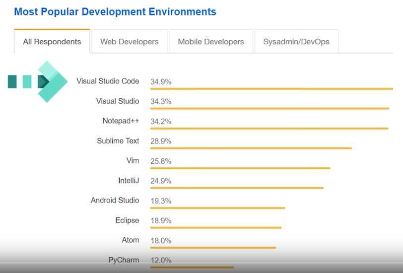
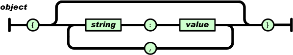
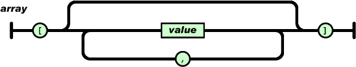
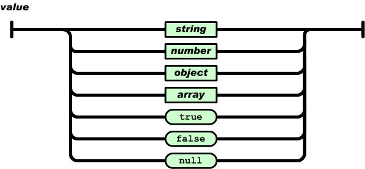
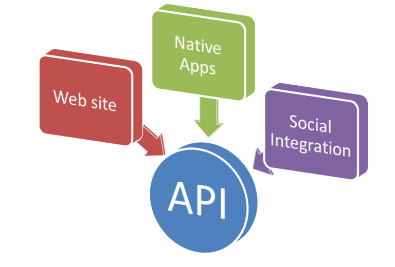
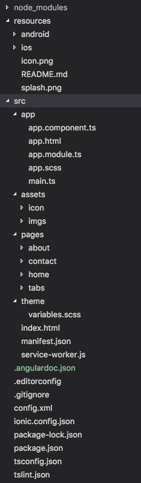
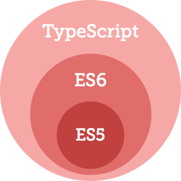

# Criando Aplicações Móveis com Ionic

## Instalar Node.js

Acessar o site  [node.js](https://nodejs.org) e solicitar o download do Node.js utilizando o primeiro botão de download que possui a versão recomendada para a maioria dos usuários (LTS).

Após o download e instalação, o Node.js estará instalado no seu sistema operacional e o NPM (Node Package Manager - Gerenciador de Pacotes do Node.js) estará disponível para instalação dos mais variados tipos de pacotes.

Os pacotes adicionados podem ter visibilidade global, ou seja, podem ser utilizados em qualquer projeto ou podem ter a visibilidade a nível de projeto, estando disponível apenas na pasta do projeto em que foi instalado.

Para instalação de pacotes **globais** temos as seguintes opções:

```sh
# Instalando um pacote pra ser utilizado globalmente no sistema operacional:
npm install -g yarn
npm i -g json-server http-server
```

## Atualizando o NPM

```sh
# Atualizar para a última versão do npm:
npm i -g npm to update
```

## Instalando o Ionic

Para criarmos aplicativos móveis utilizando o Ionic, devemos realizar a instalação do mesmo, juntamento com o Apache Cordova, para que possamos utilizar o recurso do Ionic Native é um wrapper TypeScript para plugins Cordova / PhoneGap que facilitam a adição de qualquer funcionalidade nativa que você precisa ao seu aplicativo móvel.

```sh
npm install -g ionic cordova
```

---

## Instalando o Visual Studio Code

Para edição do código fonte do aplicativo será utilizado o editor de textos [**Visual Studio Code**](https://code.visualstudio.com/). O **VSCODE** como também é conhecido tem se tornado muito popular entre os desenvolvedores e tem conquistado muitos adeptos.



> O **Visual Studio Code** é um [editor de](https://pt.wikipedia.org/wiki/Editor_de_texto) [código-fonte](https://pt.wikipedia.org/wiki/C%C3%B3digo-fonte) desenvolvido pela [Microsoft](https://pt.wikipedia.org/wiki/Microsoft) para [Windows](https://pt.wikipedia.org/wiki/Windows), [Linux](https://pt.wikipedia.org/wiki/Linux) e [macOS](https://pt.wikipedia.org/wiki/MacOS). Ele inclui suporte para [depuração](https://pt.wikipedia.org/wiki/Depura%C3%A7%C3%A3o), controle [Git](https://pt.wikipedia.org/wiki/Git) incorporado, [realce de sintaxe](https://pt.wikipedia.org/wiki/Realce_de_sintaxe), complementação inteligente de código, *snippets* e [refatoração de código](https://pt.wikipedia.org/wiki/Refatora%C3%A7%C3%A3o).
>
> O Visual Studio Code pode ser estendido através de [plugins](https://pt.wikipedia.org/wiki/Plug-in), disponíveis através de um repositório central. Isso inclui adições ao editor e suporte para linguagens de programação.
>
> Fonte: [Wikipedia](https://pt.wikipedia.org/wiki/Visual_Studio_Code)

### Extenções Úteis para o Desenvolvimento de Código com Ionic/Angular

- All Autocomplete
- Angular 2, 4 and upcoming latest Typescript HTML ES6 fequently used snippets
- Angular 6 Snippets - TypeScript, Html, Angular Material, ngRx, RxJS & Flex Layout
- Angular Language Service
- Angular v6 Snippets
- Auto Import
- Auto Rename Tag
- Bracket Pair Colorizer
- Close All
- Color Highlight
- Copy Relative Path
- Indenticator
- Ionic 3 ionView Snippets
- Ionic 3 snippets
- JavaScript (ES6) code snippets
- json2ts
- Multiple cursor case preserve
- Text Manipulator
- Trailing Spaces
- TSLint
- TypeScript Hero
- vscode-icons

### Principais configurações:

```js
{
   "editor.fontFamily": "Menlo, Monaco, 'Courier New', monospace",
    "editor.fontSize": 17,
    "window.zoomLevel": 0,
    "editor.tabSize": 2,
    "editor.formatOnType": true,
    "workbench.iconTheme": "vscode-icons",
    "workbench.colorCustomizations": {
      "tab.activeBackground": "#01579b",
      "editor.lineHighlightBackground": "#38393A",
      "editorGutter.background": "#2A2A2B",
    },
    "vsicons.projectDetection.autoReload": true,
    "editor.snippetSuggestions": "top",
    "emmet.showSuggestionsAsSnippets": true,
    "editor.wordWrap": "on",
    "files.insertFinalNewline": true,
    "editor.renderLineHighlight": "all",

    "terminal.integrated.fontFamily": "Menlo, Monaco, 'Courier New', monospace",
    "terminal.integrated.fontSize": 16,
    "typescript.check.tscVersion": false,
    "editor.minimap.enabled": true,
    "extensions.autoUpdate": true,
    "editor.renderIndentGuides":	true,
    "editor.dragAndDrop":	true,
    "search.smartCase": true
}
```

---

## REST: Princípios e boas práticas

Representational State Transfer (Transferência de Estado Representacional), abreviado como REST, não é uma tecnologia, uma biblioteca, e nem tampouco uma arquitetura, mas sim um modelo a ser utilizado para se projetar arquiteturas de software distribuído, baseadas em comunicação via rede.

REST é um dos modelos de arquitetura que foi descrito por Roy Fielding, um dos principais criadores do protocolo HTTP, em sua tese de doutorado e que foi adotado como o modelo a ser utilizado na evolução da arquitetura do protocolo HTTP.

Muitos desenvolvedores perceberam que também poderiam utilizar o modelo REST para a implementação de Web Services, com o objetivo de se integrar aplicações pela Web, e passaram a utilizá-lo como uma alternativa ao SOAP.

### Identificação dos Recursos

Toda aplicação gerencia algumas informações. Uma aplicação de um E-commerce, por exemplo, gerencia seus produtos, clientes, vendas, etc. Essas **coisas** que uma aplicação gerencia são chamadas de **Recursos** no modelo REST.

Um recurso nada mais é do que uma abstração sobre um determinado tipo de informação que uma aplicação gerencia, sendo que um dos princípios do REST diz que todo recurso deve possuir uma identificação única. Essa identificação serve para que a aplicação consiga diferenciar qual dos recursos deve ser manipulado em uma determinada solicitação.

A identificação do recurso deve ser feita utilizando-se o conceito de URI (Uniform Resource Identifier), que é um dos padrões utilizados pela Web. Alguns exemplos de URI’s:

- http://servicorest.com.br/produtos
- http://servicorest.com.br/clientes
- http://servicorest.com.br/clientes/57
- http://servicorest.com.br/vendas

As URI’s são a interface de utilização dos seus serviços e funcionam como um **contrato** que será utilizado pelos clientes para acessá-los. 

### Vejamos agora os principais métodos do protocolo HTTP e o cenário de utilização de cada um deles:

| Verbo  | Descrição                                      |
| ------ | ---------------------------------------------- |
| GET    | Obter os dados de um recurso.                  |
| POST   | Criar um novo recurso.                         |
| PUT    | Substituir os dados de um determinado recurso. |
| PATCH  | Atualizar parcialmente um determinado recurso. |
| DELETE | Excluir um determinado recurso.                |

Veja a seguir o padrão de utilização dos métodos HTTP em um serviço REST, que é utilizado pela maioria das aplicações e pode ser considerado uma boa prática. Como exemplo será utilizado um recurso chamado Cliente.

| **Método** | **URI**      | **Utilização**                                |
| ---------- | ------------ | --------------------------------------------- |
| GET        | /clientes    | Recuperar os dados de todos os clientes.      |
| GET        | /clientes/id | Recuperar os dados de um determinado cliente. |
| POST       | /clientes    | Criar um novo cliente.                        |
| PUT        | /clientes/id | Atualizar os dados de um determinado cliente. |
| DELETE     | /clientes/id | Excluir um determinado cliente.               |

### Representações dos recursos

Os recursos ficam armazenados pela aplicação que os gerencia. Quando são solicitados pelas aplicações clientes, por exemplo em uma requisição do tipo GET, eles não “abandonam” o servidor, como se tivessem sido transferidos para os clientes. Na verdade, o que é transferido para a aplicação cliente é apenas uma **representação** do recurso.

Um recurso pode ser representado de diversas maneiras, utilizando-se formatos específicos, tais como JSON, XML, HTML, CSV, dentre outros, sendo o JSON (JavaScript Object Notation - Notação de Objetos JavaScript) o formato mais utilizado. 

Em JSON, os dados são apresentados desta forma:

Um **objeto** é um conjunto desordenado de pares nome/valor. Um objeto começa com `{` (chave de abertura) e termina com `}` (chave de fechamento). Cada nome é seguido por `:` (dois pontos) e os pares nome/valor são seguidos por `,` (vírgula).



Uma **array** é uma coleção de valores ordenados. O array começa com `[` (conchete de abertura) e termina com `]` (conchete de fechamento). Os valores são separados por `,` (vírgula).



Um valor (value, na imagem acima) pode ser uma cadeia de caracteres (string), ou um número, ou `true` ou `false`, ou `null`, ou um objeto ou uma array. Estas estruturas podem estar aninhadas.



Exemplo de representação de um recurso no formato JSON.

```json
{
  "id": 1,
  "name": "Leanne Graham",
  "username": "Bret",
  "email": "Sincere@april.biz",
  "address": {
    "street": "Kulas Light",
    "suite": "Apt. 556",
    "city": "Gwenborough",
    "zipcode": "92998-3874",
    "geo": {
      "lat": "-37.3159",
      "lng": "81.1496"
    }
  },
  "phones": [
    "1-770-736-8031 x56442",
    "1-770-736-8031 x56443",
    "1-770-736-8031 x56444"
  ],
  "website": "hildegard.org",
  "company": {
    "name": "Romaguera-Crona",
    "catchPhrase": "Multi-layered client-server neural-net",
    "bs": "harness real-time e-markets"
  }
}
```
### JSON vs XML

Formato JSON:

``` json
{
	"employees": [
  	{ "firstName":"John", "lastName":"Doe" },
  	{ "firstName":"Anna", "lastName":"Smith" },
  	{ "firstName":"Peter", "lastName":"Jones" }
	]
}
```

Formato XML:
```xml
<employees>
  <employee>
    <firstName>John</firstName> <lastName>Doe</lastName>
  </employee>
  <employee>
    <firstName>Anna</firstName> <lastName>Smith</lastName>
  </employee>
  <employee>
    <firstName>Peter</firstName> <lastName>Jones</lastName>
  </employee>
</employees>
```

### REST x RESTFull

Existe uma certa confusão quanto aos termos **REST e RESTful.** Entretanto, ambos representam os mesmo princípios. A diferença é apenas gramatical. Em outras palavras, sistemas que utilizam os princípios REST são chamados de RESTful.

**REST:** conjunto de princípios de arquitetura  
**RESTful:** capacidade de determinado sistema aplicar os princípios de REST.

### Utilização correta dos códigos HTTP

Na verdade, esse não é um princípio do REST, mas sim uma boa prática.

No protocolo HTTP, toda requisição feita por um cliente a um servidor deve resultar em uma resposta, sendo que nela existe um código HTTP, utilizado para informar o resultado da requisição, tenha ela sido processada com sucesso ou não.

Existem dezenas de códigos HTTP, cada um tendo sua semântica especifica e devendo ser utilizado quando fizer sentido. Os códigos HTTP são agrupados em classes, conforme demonstrado a seguir:

| **Classe** | **Semântica**                                                |
| ---------- | ------------------------------------------------------------ |
| 2xx        | Indica que a requisição foi processada com sucesso.          |
| 3xx        | Indica ao cliente uma ação a ser tomada para que a requisição possa ser concluída. |
| 4xx        | Indica erro(s) na requisição causado(s) pelo cliente.        |
| 5xx        | Indica que a requisição não foi concluída devido a erro(s) ocorrido(s) no servidor. |

A boa prática consiste em conhecer os principais códigos HTTP e utilizá-los de maneira correta. Veja os principais códigos HTTP e quando os utilizar:

| **Código** | **Descrição**          | **Quando utilizar**                                          |
| ---------- | ---------------------- | ------------------------------------------------------------ |
| 200        | OK                     | Em requisições GET, PUT e DELETE executadas com sucesso.     |
| 201        | Created                | Em requisições POST, quando um novo recurso é criado com sucesso. |
| 204        | No Content        | Em requisições que não devolvem conteúdo de um recurso. |
| 206        | Partial Content        | Em requisições GET que devolvem apenas uma parte do conteúdo de um recurso. |
| 302        | Found                  | Em requisições feitas à URI’s antigas, que foram alteradas.  |
| 400        | Bad Request            | Em requisições cujas informações enviadas pelo cliente sejam invalidas. |
| 401        | Unauthorized           | Em requisições que exigem autenticação, mas seus dados não foram fornecidos. |
| 403        | Forbidden              | Em requisições que o cliente não tem permissão de acesso ao recurso solicitado. |
| 404        | Not Found              | Em requisições cuja URI de um determinado recurso seja inválida. |
| 405        | Method Not Allowed     | Em requisições cujo método HTTP indicado pelo cliente não seja suportado. |
| 406        | Not Acceptable         | Em requisições cujo formato da representação do recurso requisitado pelo cliente não seja suportado. |
| 415        | Unsupported Media Type | Em requisições cujo formato da representação do recurso enviado pelo cliente não seja suportado. |
| 429        | Too Many Requests      | No caso do serviço ter um limite de requisições que pode ser feita por um cliente, e ele já tiver sido atingido. |
| 500        | Internal Server Error  | Em requisições onde um erro tenha ocorrido no servidor.      |
| 503        | Service Unavailable    | Em requisições feitas a um serviço que esta fora do ar, para manutenção ou sobrecarga. |

Utilize o código correto para cada tipo de situação. Evite a má prática de sempre utilizar um mesmo código genérico para todas as situações, como por exemplo o código 200 para qualquer tipo de requisição bem-sucedida ou o código 500 para qualquer requisição malsucedida.

### O que é API?

O acrônimo **API** que provém do inglês **Application Programming Interface** (Em português, significa Interface de Programação de Aplicações), trata-se de um conjunto de rotinas e padrões estabelecidos e documentados por uma aplicação A, para que outras aplicações consigam utilizar as funcionalidades desta aplicação A, sem precisar conhecer detalhes da implementação do software.

Desta forma, entendemos que as APIs permitem uma **interoperabilidade entre aplicações**. Em outras palavras, a comunicação entre aplicações e entre os usuários.



> Fontes:  
> [Caelum](http://blog.caelum.com.br/rest-principios-e-boas-praticas)  
> [Introdução ao JSON](https://www.json.org/json-pt.html)  
> [Becode](https://becode.com.br/o-que-e-api-rest-e-restful)  
> [w3schools.com](https://www.w3schools.com/js/js_json_xml.asp)

---

## Testando uma API

### Insomnia REST Client

> Debug APIs like a <u>human</u>, not a robot.  
> Finally, a REST client you'll love.

### Crie requisições HTTP

Especifique a URL, payload, cabeçalhos e autorização em um só lugar. Então é só apertar enviar.

### Visualize os detalhes da resposta

Veja todos os detalhes em todas as respostas. Ver código de status, corpo, cabeçalhos, cookies e muito mais!

### Organize tudo

Crie áreas de trabalho ou pastas, arraste e solte solicitações e importe e exporte facilmente seus dados.

### Plataformas

**Livre** e **código aberto** disponível para  Mac, Windows, and Linux.

---

## APIS Online para Testes

### JSONPlaceholder

[Site do JSONPlaceholder](https://jsonplaceholder.typicode.com)

### REQ | RES

[Site do REQ - RES](https://reqres.in/)

---

## Criando um Novo Aplicativo

Para criarmos um novo projeto de um aplicativo utilizando o Ionic framework, basta que iniciemos com uma das formas abaixo:

```sh
# Cria um novo aplicativo utilizando um template com a tela em branco.
ionic start myApp blank

# Cria um novo aplicativo utilizando um template de abas.
ionic start myApp tabs

# Cria um novo aplicativo utilizando um template de menu lateral (sidemenu).
ionic start myApp sidemenu
```

## Executando o Aplicativo

```sh
ionic serve
```
Em modo de desenvolvimento do aplicativo, utiliza-se o prórprio navegador de internet para testar a aplicação, uma vez que o próprio comando `ionic serve` abre o navegador após o término de sua execução.

## Criando Meu Primeiro Aplicativo

Vamos criar uma aplicação de exemplo para estudarmos alguns conceitos iniciais sobre o Ionic.

### Criando o Aplicativo

```sh
ionic start my-app tabs

# ❯❯❯ ionic start my-app tabs
# ✔ Preparing directory ./my-notes-app - done!
# ✔ Downloading and extracting sidemenu starter - done!
# ? Integrate your new app with Cordova to target native iOS and Android? (y/N) y
#  ...
# ? Install the free Ionic Pro SDK and connect your app? (Y/n) n
```

### Principais Tópicos de Estudo

- Estrutura do Projeto
- Conhecendo Typescript
- Conhecendo algumas diretivas do Angular
- Principais comandos do generate

### Estrutura do Projeto

Exemplo da estrutura de um projeto inicial criado com Ionic. 

 

A pasta **resources** guarda as imagens do ícone e da tela inicial do aplicativo para que uma vez definida, seja *automaticamente* convertida para o Android e iOS.

A pasta **src** guarda o código fonte de toda a aplicação. É nesta pasta que ficam armazenadas as páginas do aplicativo, os arquivos de modelo, componentes,  providers, etc.

A pasta **app** é responsável pelo carregamento dos módulos de bibliotecas principais da aplicação, define qual será a página que será exibida na inicialização do aplicativo e possui o arquivo de folhas de estilo global da aplicação.

A pasta **assets** pode guardar ícones e outras imagens que serão utilizadas no aplicativo.

A pasta **pages** é o local onde todas as páginas do aplicativo ficam armazenadas.

A pasta **theme** é utilizada para a definição do tema de cores que serão utilizadas no aplicativo.

O arquvio **config.xml** possui informações sobre o aplicativo como o id, versão, nome do aplicativo, dentre outras.

O arquvio **.gitignore** possui a definição de quais arquivos e pastas que não devem ser adicionadas ao repositório git.

o arquvio **package.json** possui a definição das bibliotecas que estão sendo utilizadas em nosso projeto, bem como guarda informações das versões das mesmas.

### Conhecendo o Typescript

TypeScript é uma linguagem criada pela Microsoft e nada mais é que um *superset* do ECMAScript 6 que, por sua vez, é um *superset* do ECMAScript 5, que usamos mais frequentemente como base para nosso clássico JavaScript. Isso significa que praticamente qualquer código JavaScript é também um código TypeScript.

#### ECMAScript 6

**ECMAScript** é uma especificação de linguagens de script com marca registrada padronizada pela Ecma International nos padrões ECMA-262 e ISO/IEC 16262. Algumas das implementações que conhecemos desta padronização estão no JavaScript, JScript e também no ActionScript, os quais são bastante utilizados em aplicações web no *client-side*. 

Com a evolução da Web e o alto uso de scripts, novas metas foram definidas pelo ECMAScript 2015 (também chamado ES6). Algumas de suas principais melhorias incluem módulos, declarações de classe, *promises* para programação assíncrona, dentre outras.



Diagrama que compara o TypeScript com as versões do ECMAScript.


#### Tipos de variáveis

Uma das funcionalidades do TypeScript é criar variáveis com tipos definidos, assim como é feito no Java.

##### Tipos primitivos

Existem 3 tipos primitivos que podemos associar a uma variável. As variáveis são criadas através da palavra reservada `let` ou `const` e o tipo é informado da seguinte forma:

```typescript
let NOME_DA_VARIAVEL: TIPO = VALOR;
```

- boolean: Pode assumir os valores `true` ou `false`
- number: Assume qualquer número, como inteiro ou ponto flutuante.
- string: Tipo texto, pode ser atribuído com aspas simples ou duplas.

##### Arrays

Arrays no TS podem ser criados através de duas formas. A primeira delas, usa-se `[]` na definição do tipo da variável, veja:

```typescript
let list: number[] = [1, 2, 3];
```

A segunda é mais conhecida como “generics” e usa `<>` para definir o tipo, veja:

```typescript
let list: Array<number> = [1,2,3];
```

Pode-se usar tipos complexos na criação de arrays, como no exemplo a seguir.

```typescript
class Pessoa {
  nome: string;
    
  constructor(nome: string) {
  	this.nome = nome;
  }
    
  sayHello(): string {
    return "Hello, " + this.nome;
  }
}

let fulano = new Pessoa("fulano");
let beltrano = new Pessoa("beltrano");

let pessoas: Pessoa[] = new Array();
pessoas.push(fulano);
pessoas.push(beltrano);

pessoas.forEach((p: Pessoa) =>
  console.log(p.sayHello());
);
```

##### Any

Uma variável do tipo `any` pode assumir qualquer valor.

```typescript
let notSure: any = 4;
notSure = "maybe a string instead";
notSure = false; // okay, definitely a boolean;
```

##### Classes

O conceito de classes no TypeScript é o mesmo de uma classe em qualquer linguagem orientada a objetos. As classes no TypeScript seguem o padrão ECMAScript 6 que em teoria será o “futuro” do JavaScript. A classe possui uma sintaxe muito familiar com c#, veja:

```typescript
class Greeter {
  greeting: string;

  constructor(message: string) {
    this.greeting = message;
  }

  greet() {
    return "Hello, " + this.greeting;
  }
}

let greeter = new Greeter("world");
```
O construtor é definido pela palavra constructor. Métodos não necessitam da palavra function, bastando apenas usar (). Perceba que, no exemplo apresentado, não definimos visibilidade das propriedades da classe, nem o tipo de retorno do método greet. É claro que podemos definir estes parâmetros, conforme o próximo exemplo.

```typescript
class Greeter {
  private greeting: string;
  
  constructor(message: string) {
    this.greeting = message;
  }
  
  public greet() : string {
    return "Hello, " + this.greeting;
  }
}

let greeter = new Greeter("world");
```

##### Visibilidade de métodos e propriedades
Métodos e propriedades de uma classe podem assumir a visibilidade: private, public e protected. Quando não informada a visibilidade de um método ou propriedade, o mesmo é assumido como public.

##### Herança
A herança entre uma classe e outra é definida pela palavra extends. Pode-se sobrecarregar métodos e usar a palavra super para chamar o método da classe pai, conforme o exemplo a seguir.

```typescript
class Animal {
  name: string;
  
  constructor(theName: string) { this.name = theName; }
  
  move(meters: number = 0) {
    alert(this.name + " moved " + meters + "m.");
  }
}

class Snake extends Animal {
  constructor(name: string) { super(name); }
  
  move(meters = 5) {
    alert("Slithering...");
    super.move(meters);
  }
}

class Horse extends Animal {
  constructor(name: string) { super(name); }
  
  move(meters = 45) {
    alert("Galloping...");
    super.move(meters);
  }
}

let sam = new Snake("Sammy the Python");
let tom: Animal = new Horse("Tommy the Palomino");

sam.move();
tom.move(34);
```

Neste exemplo usamos o super da classe Snake para chamar o método construtor da classe pai Animal. Se isso não for claro para você, dê uma estudada em OO para que possa compreender melhor, pois estas características são da Orientação em Objetos como um todo, e não do TypeScript.

##### Accessors (ou métodos get/set)

Os Accessors visam proteger as propriedades de uma classe, pois você já deve saber que expor propriedades de uma classe não é algo legal.

Os accessors do TypeScript são feitos pelas palavras **get** e **set**, e claro, deixe a sua propriedade como private. Veja o exemplo a seguir.

```typescript
class Pessoa {
   private _password: string;

  get password(): string {
    return this._password;
  }
    
  set password(p : string) {
    if (p != "123456") {
      this._password = p;
    } else {
      alert("Ei, senha não pode ser 123456");
    }
  }
}

var p = new Pessoa();
p.password = "123456"; //vai exibir o erro
```

##### Interfaces
Uma interface define um contrato para a classe. A interface é criada da seguinte forma:

```typescript
interface Ponto {
 x: number;
 y: number;
 x: number;
}
```

Para implementar a interface, usamos implements

```typescript
class Ponto3d implements Ponto {
   (aqui implementamos x,y,z)
}
```

##### Funções

Vamos exemplificar algumas particularidades de uma função em TypeScript. A função pode ser criada fora de uma classe ou dentro, sendo as observações que faremos a seguir podem ser aplicadas em ambas.

Tome nota apenas que, em uma classe, não precisamos usar a palavra function para definir uma função, mas fora da classe precisamos.

###### Parâmetros com valores padrão

Pode-se definir um valor padrão para um parâmetro de uma função da seguinte forma:

```typescript
function buildName(firstName: string, lastName : string = "Smith") {
}
// ou
class Foo {
  buildName(firstName: string, lastName : string = "Smith") {
  }
}
```

###### Parâmetros opcionais

Use o caractere ? para definir um parâmetro opcional.

```typescript
class Foo {
  buildName(firstName: string, lastName? : string) {
  	if (lastName) {
    	// blablabla
    }
  }
}
```

> Fontes:  
> [Introdução ao TypeScript](https://www.devmedia.com.br/introducao-ao-typescript/36729)  
> [O mínimo que você precisa saber sobre TypeScript](https://medium.com/@matheusmariano/o-m%C3%ADnimo-que-voc%C3%AA-precisa-saber-sobre-typescript-58d1b418f78b)  

### Conhecendo algumas diretivas do Angular

- *ngIf
- *ngIf - else
- *ngFor
- [disabled]
- [class]
- [style]

### Principais comandos do generate

O ionic cli possui comandos para geração de conteúdos de forma que podemos obter mais produtividade na criação de pages, providers, components, pipes e tabs.

```sh
ionic generate page [nome-da-pagina]
ionic generate provider [nome-do-provedor]
ionic generate component [nome-do-componente]
```

...

## Executando no dispositivo - Android ou iOS

Para executarmos o aplicativo que está sendo criado diretamente no dispositivo, devemos primeiramente adicionar a plataforma para o dispositivo que será utilizado e em seguida solicitar a execução do aplicativo na plataforma desejada.

```sh
# Adicionando a plataforma android e/ou ios:
ionic cordova platform add android
ionic cordova platform add ios

# Após isso para executar o aplicativo direto no celular:
ionic cordova run android [--livereload]
ionic cordova run ios [--livereload]
```

## Gerando o build para Android (apk) ou iOS (ipa)

```sh
ionic cordova build android --prod --release
ionic cordova build ios --prod --release
```

## Gerar o Ícone e Splash Screen
The source **image for icons** should ideally be at least **1024×1024px** and located at <u>resources/icon.png</u>.

For best results, the **splash screen’s** artwork should roughly fit within a square (**1200×1200px**) at the center of the image and located at <u>resources/splash.png</u>. You can use https://code.ionicframework.com/resources/splash.psd as a template for your splash screen.

```sh
ionic cordova resources [platform]
```

## Habilitar o modo Desenvolvedor no Android
Abrir configurações -> Sobre -> Pressionar 6x sobre a versão do Android.
Ativar o modo e ligar a depuração USB. Também será necessário habilitar fontes desconhecidas na opção de segurança em configurações.

